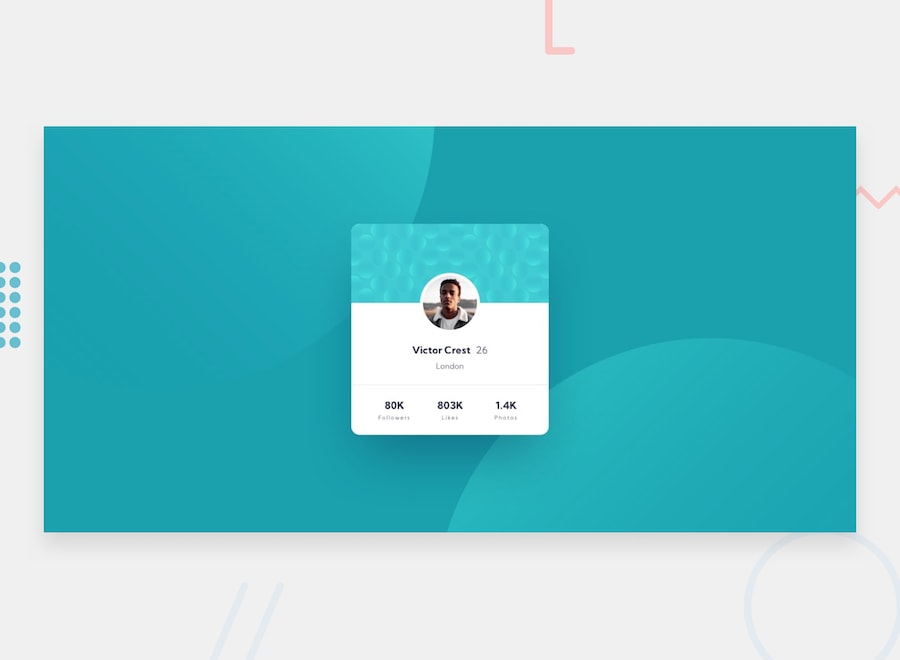

# Frontend Mentor - Profile card component

This is a solution to the [Profile card component challenge on Frontend Mentor](https://www.frontendmentor.io/challenges/profile-card-component-cfArpWshJ). Frontend Mentor challenges help you improve your coding skills by building realistic projects.

## Table of contents

- [Overview](#overview)
  - [Screenshot](#screenshot)
  - [Links](#links)
- [My process](#my-process)
  - [Built with](#built-with)
  - [Extra feature](#extra-feature)
  - [What I learned](#what-i-learned)

## Overview

### Screenshot

### Links

- [Solution URL](https://github.com/MATBMS/profile-card)
- [Live Site URL](https://matbms-profile-card.netlify.app/)

## My process

### Built with

- Semantic HTML5 markup
- CSS custom properties
- Flexbox
- Mobile-first workflow

### Extra feature

No Extra Feature.

### What I learned

Nothing new.
